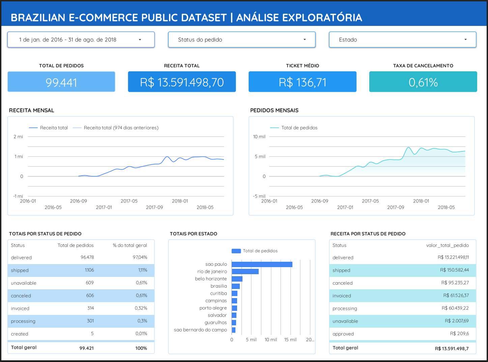
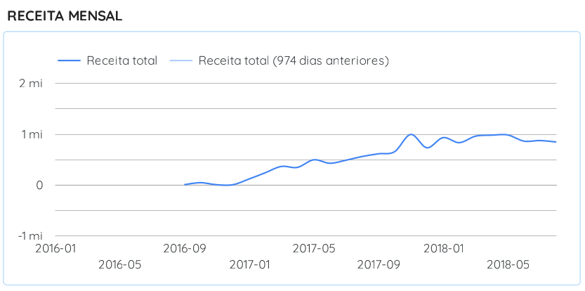

# 📊 Brazilian E-commerce Public Dataset | SQL + Dashboard Executivo

Este projeto tem como objetivo realizar uma Análise Exploratória de Dados (EDA) utilizando **SQL no BigQuery**, seguida da construção de um **Dashboard Executivo no Looker Studio**, a partir do Brazilian E-commerce Public Dataset (Olist).

O projeto evolui da exploração técnica dos dados para uma modelagem estruturada e criação de uma camada analítica preparada para consumo em BI.

---

## 🎯 Objetivos do Projeto

- Explorar e compreender a estrutura do dataset Olist
- Realizar análises utilizando SQL no BigQuery
- Tratar inconsistências e validar integridade dos dados
- Criar uma view analítica no nível do pedido
- Construir um dashboard executivo com foco em performance

---

## 🛠️ Tecnologias Utilizadas

- **Google BigQuery** (SQL)
- **Looker Studio**
- **GitHub**
- Dataset público: Brazilian E-commerce Public Dataset (Olist)

---

## 🧠 Modelagem de Dados

### 🔎 Problema Identificado

Durante a construção do dashboard foi identificada uma divergência no total de pedidos:

- Tabela `orders`: **99.441 pedidos**
- View inicial: **98.666 pedidos**

Após investigação, foi identificado que **775 pedidos não possuíam registros na tabela `order_items`**.

Como a view utilizava `INNER JOIN`, esses pedidos estavam sendo automaticamente excluídos.

---

### ✅ Solução Aplicada

- Substituição de `INNER JOIN` por `LEFT JOIN`
- Garantia de granularidade no nível do pedido (`order_id`)
- Uso de `COALESCE` para evitar valores nulos
- Agregação correta para evitar duplicidade causada por múltiplos produtos

---

## 📦 View Base para o Dashboard

```sql
CREATE OR REPLACE VIEW `dataset-464615.portifolio2026.vw_dashboard_base` AS
SELECT
    o.order_id,
    o.customer_id,
    
    -- Datas
    DATE(o.order_purchase_timestamp) AS data_pedido,
    FORMAT_DATE('%Y-%m', DATE(o.order_purchase_timestamp)) AS mes,
    
    -- Status
    o.order_status,
    
    -- Localização
    c.customer_state,
    c.customer_city,
    
    -- Métricas financeiras no nível do pedido
    COALESCE(SUM(oi.price), 0) AS valor_total_pedido,
    COALESCE(SUM(oi.freight_value), 0) AS valor_frete_total,
    COALESCE(SUM(oi.price + oi.freight_value), 0) AS receita_total_pedido

FROM `dataset-464615.portifolio2026.orders` o

LEFT JOIN `dataset-464615.portifolio2026.order_items` oi 
    ON o.order_id = oi.order_id

LEFT JOIN `dataset-464615.portifolio2026.customers` c 
    ON o.customer_id = c.customer_id

GROUP BY
    o.order_id,
    o.customer_id,
    data_pedido,
    mes,
    o.order_status,
    c.customer_state,
    c.customer_city;
```

## 📊 Dashboard Executivo

O dashboard foi desenvolvido no **Looker Studio** com foco executivo e visão consolidada do período selecionado.

🔗 **Acesse o dashboard aqui:** 
[Visualizar Dashboard](https://lookerstudio.google.com/s/mEOhoQVymTE)

---

## 📊 Dashboard Preview

### Visão Geral



### Receita Mensal

  

## 📌 Indicadores Principais

- Total de pedidos 
- Receita total 
- Ticket médio 
- Taxa de cancelamento 
- Receita mensal 
- Pedidos mensais 
- Distribuição por status de pedido 
- Distribuição geográfica por estado 

---

## 📈 Principais Insights

- Crescimento consistente de receita ao longo de 2017 
- Pico de vendas no final de 2017 
- Forte concentração de pedidos no estado de São Paulo 
- Taxa de cancelamento inferior a 1% 
- Mais de 97% dos pedidos com status **"delivered"**

---

## 🧩 Decisões Técnicas Importantes

- Modelagem no nível do pedido para evitar duplicidade 
- Validação entre camada SQL e camada BI 
- Correção de inconsistência causada por `INNER JOIN` 
- Consolidação de métricas financeiras na view analítica 
- Separação entre camada de transformação (BigQuery) e visualização (Looker) 

---

## 🚀 Próximos Passos

- Implementar cálculo de crescimento mês a mês 
- Criar análise por categoria de produto 
- Analisar tempo médio de entrega 
- Estudo de comportamento de recompra 

---

## 👨‍💻 Autor

**Sharon Fernando**

Projeto desenvolvido para portfólio em Análise de Dados.

